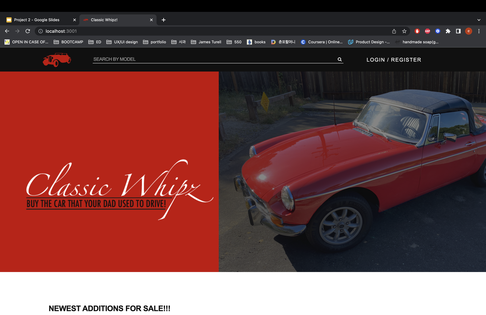
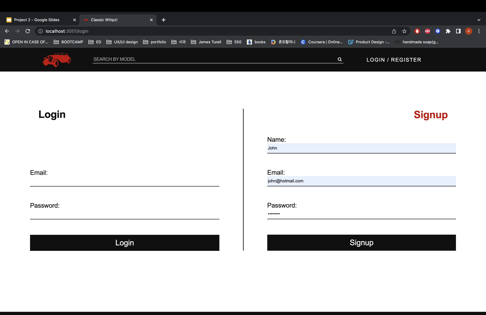
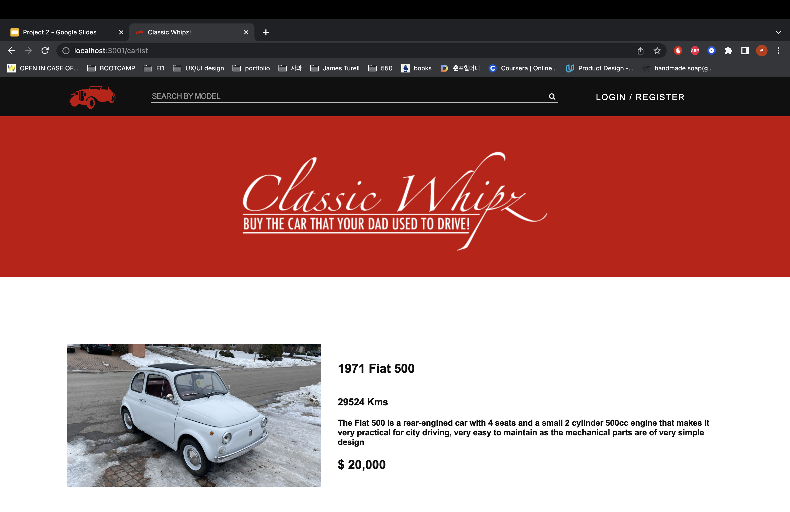
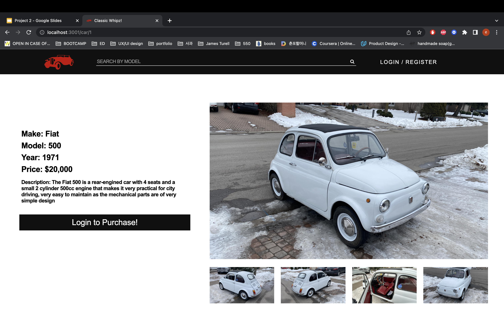
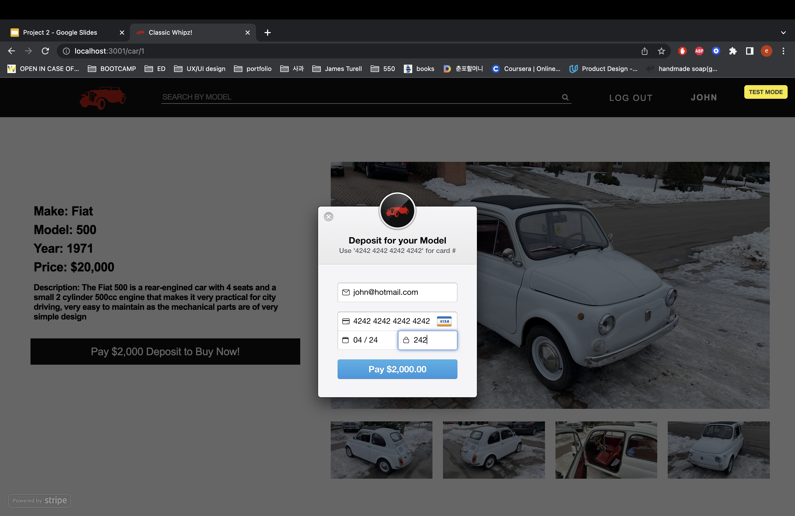
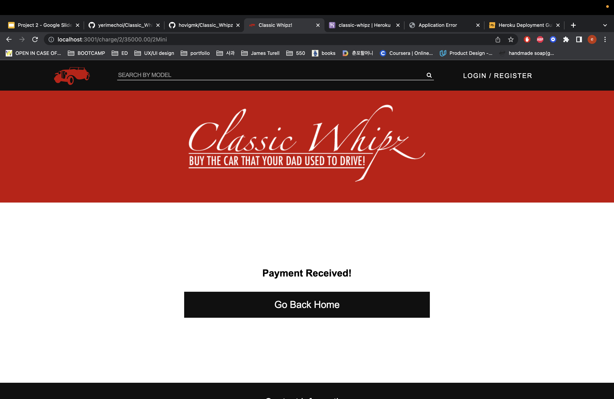

# Classic Whipz

## Description
Classic Whipz is a car e-commerce site that allows you to buy and sell classic cars. The site contains cars that are labeled vintage to newly classic ones. The process is once the buyer selects to buy, they pay 10% of the car value then it the connects the buyer to the seller. Both the buyer and the seller agree on a rendezvous.

## Installation
To access this project, you can click on the GitHub URL and clone the repository locally. Another way to access this project is by clicking on the deployed Heroku Link.
GitHub Link: https://github.com/hovigmk/Classic_Whipz
Heroku Link: https://classiccarswebsite.herokuapp.com/

## Usage
Type "mysql -u root -p" in the command line to enter the SQL shell and run the schema.sql file and then quit
Type "npm run seed" to upload the database with data  
Type node server.js OR npm start 
Type "http://localhost:3001/" in your browser to see the output

## Mock Up
The following shows the creation of an HTML file that shows a team profile through node js. 

## Technology Used
Stripe https://stripe.com/docs/js

## Contributors
Hovig https://github.com/hovigmk

Cezar https://github.com/cdennis27

Esther https://github.com/yerimechoi

## License
N/A